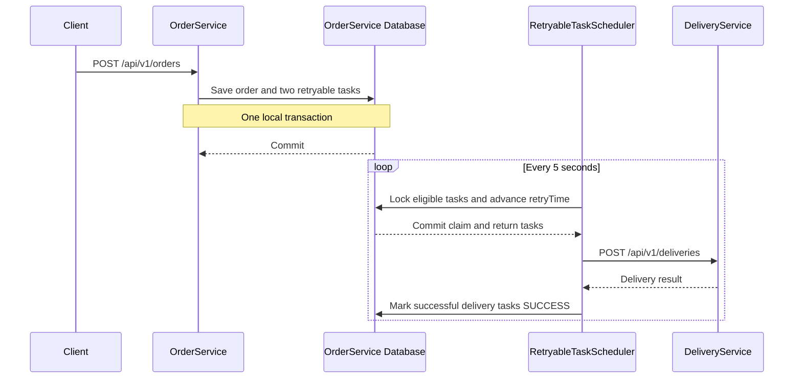

# Transactional Outbox Pattern

A Java and Spring Boot demonstration of the transactional outbox pattern for coordinating order creation with asynchronous downstream operations. The implementation stores an order and its associated retryable tasks in the same database transaction, then uses a scheduled worker to process those tasks over HTTP.

This project uses a database-backed task outbox without a message broker. It demonstrates the core transaction and retry workflow, with implementation gaps documented below.

## Architecture

| Component | Responsibility | Default port |
| --- | --- | --- |
| `OrderService` | Creates orders, persists outbox tasks, and schedules processing | `8083` |
| `DeliveryService` | Accepts delivery requests and returns a simulated successful response | `8081` |
| H2 database | Stores orders and retryable tasks inside OrderService | Embedded |

OrderService uses Spring Boot 3.2.10, Spring Data JPA, OpenFeign 4.1.3, MapStruct 1.5.2.Final, and Lombok. DeliveryService uses Spring Boot 3.4.3. Both services target Java 17.



The diagram describes the intended delivery flow. The task-type mapping issue listed under **Current limitations** prevents newly created tasks from being selected in the current implementation.

## How the Outbox Works

### Atomic order and task creation

`OrderService.createOrder()` is transactional. It saves an `Order` and creates two `RetryableTask` records:

- `SEND_CREATE_DELIVERY_REQUEST`
- `SEND_CREATE_NOTIFICATION_REQUEST`

Task creation joins the enclosing transaction. The order and both tasks commit together or roll back together, avoiding a separate database write followed by a synchronous downstream request during order creation.

`RetryableTaskMapper` serializes the order into a JSON payload and initializes the task with a UUID, timestamps, version `0`, status `IN_PROGRESS`, and an immediately eligible `retryTime`.

### Task selection and reservation

`RetryableTaskScheduler` runs every five seconds and dispatches tasks to a processor for each task type. `RetryableTaskRepository` selects tasks that match the requested type, have status `IN_PROGRESS`, and have `retryTime` at or before the current time. Results are ordered by `retryTime` and limited by the configured batch size.

The selection query uses a pessimistic write lock. Within the selection transaction, `RetryableTaskService` advances each selected task's `retryTime` by the configured timeout. JPA persists these changes when the transaction commits. The lock protects the reservation step; HTTP processing happens after that transaction ends.

### Delivery processing and retries

`SendCreateDeliveryRequestRetryableTaskProcessor` deserializes each task payload and passes the order ID and delivery address to the OpenFeign delivery client.

- A response with status `"success"` causes the task to be marked `SUCCESS`.
- An exception or another response status leaves the task `IN_PROGRESS`.
- An unfinished task becomes eligible again after its reserved `retryTime` expires.

The timeout applies to every selected task before processing, so it acts as both a reservation period and the delay before retrying failed work. There is no attempt limit or exponential backoff.

### Outbox record

| Field | Purpose |
| --- | --- |
| `id` | UUID identifying the task |
| `payload` | JSON snapshot of the order |
| `type` | Selects the downstream operation and processor |
| `status` | `IN_PROGRESS` or `SUCCESS` |
| `retryTime` | Earliest time the task can be selected again |
| `createdAt`, `updatedAt` | Audit timestamps |
| `version` | JPA optimistic locking version |

Enum converters persist readable strings, including `IN PROGRESS`, `SEND CREATE DELIVERY REQUEST`, and `SEND CREATE NOTIFICATION REQUEST`.

## Running Locally

### Prerequisites

- JDK 17
- Maven 3.6.3 or later
- Available ports `8081` and `8083`

The services are independent Maven projects. Run the following commands from the repository root in separate terminals.

Start DeliveryService:

```bash
mvn -f DeliveryService/pom.xml spring-boot:run
```

Start OrderService:

```bash
mvn -f OrderService/pom.xml org.springframework.boot:spring-boot-maven-plugin:3.2.10:run
```

OrderService does not declare the Spring Boot Maven plugin in its POM, so the command supplies the plugin coordinates explicitly. An included Maven wrapper can also be used from its directory with `bash mvnw` on Unix or `mvnw.cmd` on Windows.

### Configuration

OrderService configuration is located in `OrderService/src/main/resources/application.yaml`.

| Setting | Default | Description |
| --- | --- | --- |
| `server.port` | `8083` | OrderService HTTP port |
| `spring.datasource.url` | `jdbc:h2:mem:testdb` | In-memory order and outbox database |
| `integration.deliveryService.url` | `http://localhost:8081/api/v1` | Base URL for the delivery client |
| `retryabletask.timeoutInSeconds` | `36000` | Reservation and retry delay: 10 hours |
| `retryabletask.limit` | `100` | Maximum tasks selected per type per scheduler run |

The delivery URL can be overridden using the `DELIVERY_SERVICE_URL` environment variable. The scheduler interval is hard-coded to `5000` milliseconds.

For a shorter local retry delay, launch OrderService with:

```bash
mvn -f OrderService/pom.xml org.springframework.boot:spring-boot-maven-plugin:3.2.10:run \
  -Dspring-boot.run.arguments="--retryabletask.timeoutInSeconds=10"
```

H2's console is enabled at `http://localhost:8083/h2-console`. Connect using JDBC URL `jdbc:h2:mem:testdb`, username `sa`, and an empty password. Orders are stored in `order_table`; the default naming strategy maps retryable tasks to `retryable_task`.

## API Examples

### Create an order

```bash
curl -i -X POST http://localhost:8083/api/v1/orders \
  -H 'Content-Type: application/json' \
  -d '{
    "customerId": 1001,
    "deliveryAddress": "123 Main Street, Warsaw",
    "paymentMethod": "CARD",
    "orderNotes": "Leave at reception",
    "customerEmail": "customer@example.com"
  }'
```

The service method creates the order and its outbox tasks without waiting for delivery processing. The current controller uses `@Controller` without `@ResponseBody`, so this endpoint does not reliably return the intended JSON `OrderDto`. Consult the database to inspect persistence; JSON responses require correcting the controller annotation as described below.

### Call DeliveryService directly

```bash
curl -i -X POST http://localhost:8081/api/v1/deliveries \
  -H 'Content-Type: application/json' \
  -d '{
    "orderId": "11111111-1111-1111-1111-111111111111",
    "deliveryAddress": "123 Main Street, Warsaw"
  }'
```

Example response:

```json
{
  "deliveryId": "22222222-2222-2222-2222-222222222222",
  "status": "success"
}
```

DeliveryService generates a new delivery UUID for each request. It does not persist deliveries or check for duplicate order IDs.

## Project Structure

```text
.
├── OrderService/
│   ├── pom.xml
│   └── src/main/
│       ├── java/com/example/demo/
│       │   ├── client/             # OpenFeign delivery client
│       │   ├── config/             # Scheduling configuration
│       │   ├── controller/         # Order endpoint
│       │   ├── mapper/             # Entity, DTO, and JSON mapping
│       │   ├── model/              # Entities, DTOs, and enums
│       │   ├── repository/         # Persistence and task locking
│       │   ├── scheduler/          # Outbox polling
│       │   ├── service/            # Order creation and task processing
│       │   └── util/               # Enum persistence converters
│       └── resources/application.yaml
└── DeliveryService/
    ├── pom.xml
    └── src/main/
        ├── java/com/example/deliveryservice/
        │   ├── controller/         # Delivery endpoint
        │   ├── model/              # Delivery DTOs and status enum
        │   └── service/            # Simulated delivery creation
        └── resources/application.yaml
```

## Current Limitations

- **Task type is not mapped.** `RetryableTaskMapper.toRetryableTask()` lacks an explicit mapping from parameter `retryableTaskType` to entity field `type`. The generated mapper leaves `type` unset, so newly created tasks do not match the scheduler's type filter. Add `@Mapping(source = "retryableTaskType", target = "type")` to enable the intended dispatch flow.
- **Notification processing is unfinished.** The notification processor is empty. Once task types are mapped, notification tasks can be reserved repeatedly but are never completed or sent to a notification service.
- **The order endpoint needs a response annotation.** Use `@RestController` or add `@ResponseBody` to return the order DTO as JSON.
- **Storage is temporary.** The configured H2 database is in memory. Orders and tasks do not survive application restarts; durable recovery requires a persistent database configuration.
- **Duplicate delivery requests are possible.** A worker can send a successful request and fail before recording `SUCCESS`. A reservation can also expire while a worker is still processing. Downstream idempotency is required to handle repeated requests safely; the delivery stub does not implement it.
- **Retry operations are basic.** There is no dead-letter state, attempt counter, stored failure reason, backoff strategy, or completed-task cleanup. Payload deserialization errors can interrupt a processing run.
- **Verification coverage is minimal.** The existing test checks Spring application context startup. It does not verify transaction rollback, task dispatch, retry recovery, or concurrent workers.

The transactional write establishes atomicity within OrderService's database. It does not provide an atomic transaction across that database and the downstream HTTP service, or exactly-once delivery.

## Build and Test

From the repository root:

```bash
mvn -f OrderService/pom.xml clean test
mvn -f DeliveryService/pom.xml clean test
```

DeliveryService currently has no test source files. These commands build the projects and run the tests that are present.
